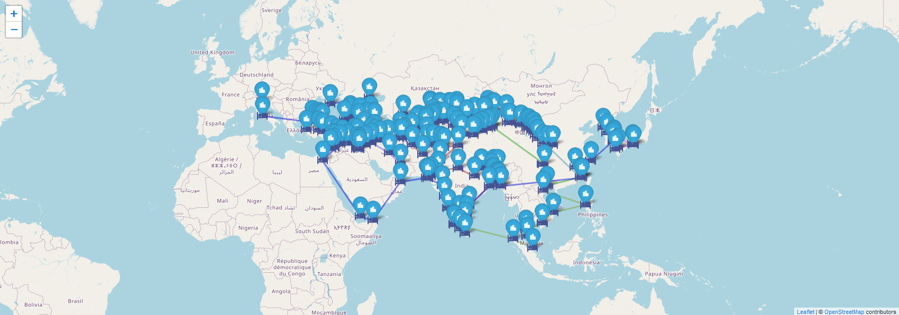

# **WebGIS Silkroad (upgraded to Vue 3 in 2026)**

Web app for viewing cities along the silkroad. Made for university's GIS (Geographic Information Systems) course. From the map you can find their coordinates, and 3 of the closest hotels for most of the cities. Roads are only connected by straight lines, so they are not geographically accurate, but city coordinates and hotel locations should be. You can find the demo running [Here](https://webgis-silkroad.onrender.com).
Web app for viewign cities along the silkroad. Made for university's GIS (Geographic Information Systems) course. From the map you can find their coordinates, and 3 of the closest hotels for most of the cities. Roads are only connected by straight lines, so they are not geographically accurate, but city coordinates and hotel locations should be. You can find the demo running [Here](https://webgis-silkroad.onrender.com). Recently upgraded the project from Vue 2 to Vue 3.

## **Project setup**

- **User interface** with [Vue 3](https://vuejs.org/), built with [Vite](https://vite.dev/) and using [Vuetify](https://vuetifyjs.com/en/)
- **Interactive map** with [Leaflet](https://leafletjs.com/) and OpenStreetMap's [Standard tile layer](https://wiki.openstreetmap.org/wiki/Standard_tile_layer)

## **Data source**

- Cities from [Wikipedia](https://en.wikipedia.org/wiki/Cities_along_the_Silk_Road)
- City coordinates fetched with [leaflet-geosearch](https://github.com/smeijer/leaflet-geosearch) and [OSM](https://smeijer.github.io/leaflet-geosearch/providers/openstreetmap)
- Hotel data fetched with [Google Places API](https://developers.google.com/maps/documentation/places/web-service/search-nearby)
- [City data](./client/src/data/data.json) and [Hotel data](./client/src/data/hotels.json) are stored into **.json** files for fast access and because Silk Road cities are not really changing in the future. Hotel data is stored because I wanted to avoid possible future costs from Google API if I leave the project up after the course.

## **Installation**

1. **cd client** (Move to client folder)
2. **npm install**
3. **npm run serve** (starts the application server. **[See Here](https://github.com/purkkilo/WebGIS-Silkroad/blob/master/client/README.md)** for more info)

## **Usage**

1. **cd client** (Move to client folder)
2. **npm run serve** (starts the application server. **[See Here](https://github.com/purkkilo/WebGIS-Silkroad/blob/master/client/README.md)** for more info)

### Express server (**/server** folder) only for hosting site to use
